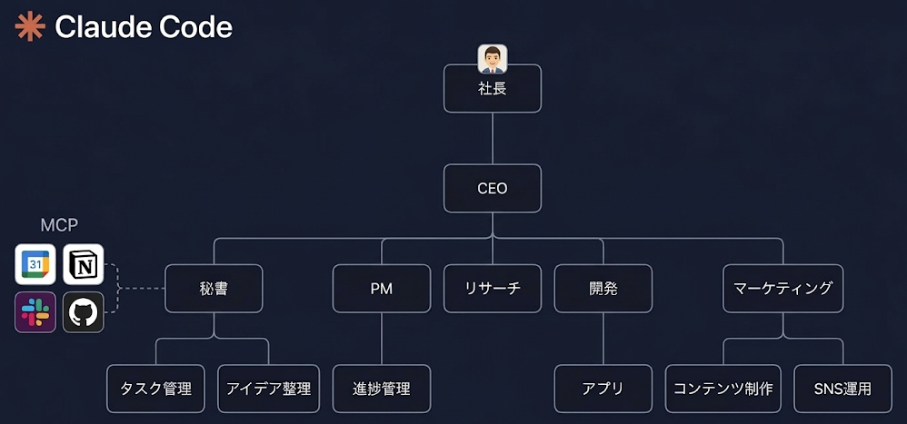

# CC Workspace Template

非エンジニアでも安全に Claude Code を業務利用できるワークスペーステンプレートです。

## コンセプト



```
あなた → 秘書（窓口） → CEO（振り分け） → 各部署
```

- **秘書**: 常に窓口。何でも相談OK。TODO管理、壁打ち、メモ
- **CEO**: 裏方で判断。部署が必要な案件を自動振り分け
- **各部署**: 専門領域のファイル管理を担当

ユーザーは部署を意識する必要なし。秘書に話しかけるだけ。

---

## セットアップ

### 前提条件

- [Claude Code](https://claude.ai/code) がインストール済み
- Git がインストール済み（`git --version` で確認）

### Step 1: クローン

```bash
git clone https://github.com/hugkumiplus/cc-workspace-template.git
cd cc-workspace-template
```

### Step 2: Claude Code を起動

```bash
claude
```

セキュリティ設定とスキルが自動で適用されます。

### Step 3: 秘書を起動

```
/secretary
```

対話的にあなた専用の管理環境がセットアップされます。

---

## 使えるスキル

| コマンド | 説明 |
|---------|------|
| `/secretary` | パーソナル秘書。TODO管理、メモ、壁打ち、ダッシュボード |
| `/company` | 仮想会社組織。秘書→CEO→部署の流れで業務を管理 |
| `/skill-create` | 自分だけのカスタムスキルを対話的に作成 |

---

## セキュリティ

3層防御で安全性を確保しています。

| 層 | 仕組み | 役割 |
|---|--------|------|
| 第1層 | サンドボックス | OS レベルでファイル・ネットワークを制限 |
| 第2層 | 権限制御（deny/allow） | 危険なコマンド・機密ファイルをブロック |
| 第3層 | hook スクリプト | 複雑なパターンを検出してブロック |

詳細は [docs/SECURITY_POLICY.md](docs/SECURITY_POLICY.md) を参照。

---

## フォルダ構成

```
cc-workspace-template/
├── CLAUDE.md                        ← セキュリティルール・基本方針
├── .claudeignore                    ← AI検索対象から除外するファイル
├── .gitignore
├── .claude/
│   ├── settings.json                ← 権限制御（deny/allow）
│   ├── scripts/                     ← hookスクリプト（4本）
│   │   ├── block-dangerous-commands.sh
│   │   ├── block-main-push.sh
│   │   ├── protect-sensitive-files.sh
│   │   └── protect-data.sh
│   └── skills/                      ← スキル
│       ├── secretary/               ← パーソナル秘書
│       ├── company/                 ← 仮想会社組織
│       └── skill-create/            ← スキル作成ツール
└── docs/
    └── SECURITY_POLICY.md           ← セキュリティポリシー詳細
```

---

## 最新版への更新

```bash
git pull origin main
```

---

## ライセンス

Copyright (c) 2026 hugkumiplus. All rights reserved.
社内利用限定。許可なく外部への再配布・公開を禁止します。
